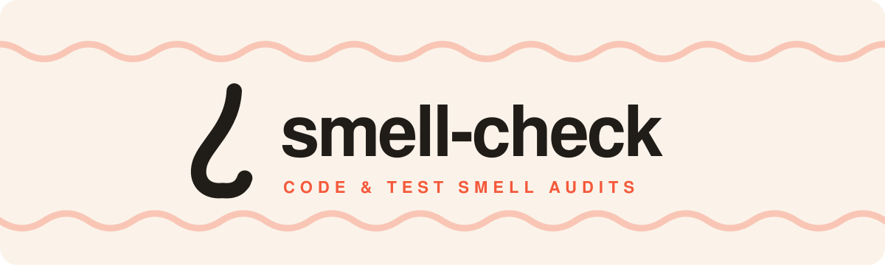

<p align="center">
  <a href="https://github.com/Zhen-Bo/smell-check">
    
  </a>
</p>

<p align="center">
  <a href="../SKILL.md">閱讀 skill 文件 »</a>
  ·
  <a href="#安裝">安裝</a>
  ·
  <a href="#報告長什麼樣子">報告範例</a>
  ·
  <a href="../README.md">English</a>
</p>

<p align="center">
  <strong>附上憑據的 codebase 健康檢查。</strong><br>
  <code>smell-check</code> 是給 AI coding agent 用的 Agent Skill。<br>
  它稽核你指定的路徑，找出 code smell 與 test smell，每個 finding 都附上證據。
</p>

<p align="center">
  <a href="../LICENSE"></a>
  <a href="https://github.com/Zhen-Bo/smell-check/releases"></a>
  <a href="https://skills.sh/Zhen-Bo/smell-check"></a>
</p>

---

它獵捕的 smell 是《Refactoring》、《Clean Code》與 test-smell 文獻整理出的可維護性警訊。
它是給 codebase 做的健康檢查，**不是 PR review bot**：不給合併建議、不改你的 code、不跑你的測試。

- **量測，不憑感覺。** 結構指標在腳本與工具（`wc`、AST 計數器、`jscpd`）能跑的地方就由它們提供；量不到的標成 `estimate`，絕不包裝成事實。
- **每筆 finding 都標證據等級。** `mechanical`（腳本算出來的）、`semantic`（agent 判斷的，依據寫明）、或 `estimate`（薄弱，且明講）。
- **只診斷，不開處方。** finding 說明哪裡有問題、為什麼、維護者要付什麼代價；修法留給負責修的人決定。
- **純靜態。** 絕不編輯你的程式碼、絕不執行你的程式或測試、絕不讀 gitignore 的路徑。

## 報告長什麼樣子

報告寫到 `.smell-check/reports/<UTC-timestamp>.md`，使用你的對話語言。
以下是稽核一個虛構 job-queue 專案的精簡節錄：

> ```yaml
> ---
> repo: task-queue
> commit: 3f9c2a1
> date: 2026-08-13
> scope: whole repo (48 files)
> profile: small (source=auto; 6,214 source-code lines)
> active: 7
> dismissed: 3
> ---
> ```
>
> # task-queue smell-check
>
> ### F-3: Worker retry policy is duplicated (`code.duplicated-knowledge`)
>
> - location: `queue/worker.py:88` and `queue/scheduler.py:41`
> - snippet:
>
> ```python
> delay = min(BASE_DELAY * (2 ** attempt), 300)
> ```
>
> - evidence: **semantic**。兩個模組手寫了同一條退避規則；其中只有一份有加 jitter 上限，兩份副本已經開始漂移。
> - consequence: 改重試策略需要兩處同步修改，下一次修改很可能漏掉一處。

被 agent 排除的 finding 也會保留，每筆附上排除它的規則例外或判斷依據，讓你可以稽核這位稽核員。

## 為什麼要有 smell-check

讀完《Refactoring》或《Clean Code》會改變你看程式碼的方式，效果大概維持一週。
沒有人能在趕工時把幾百頁的判斷力放在腦中，也沒有人會在任務進行到一半回去翻書。

同時，coding agent 寫的 code 越來越多，而下 prompt 的人自己腦子裡掌握的卻越來越少。
「閱讀程式碼」這件事仍然必須發生；只是人類不再是負擔得起這件事的那一方。

那些書早就把「怎麼閱讀一個 codebase」寫下來了。
`smell-check` 把它變成 agent 可以執行的程序：用量測取代記憶、用證據取代印象、每筆 finding 的判斷都留下紀錄。
它是 linter、type checker 與測試的互補，不是替代品。

## 安裝

```bash
npx skills add Zhen-Bo/smell-check
```

<details>
<summary>選配量測工具</summary>

skill 只靠 `git`＋`wc`＋Python 3 就能運作。
額外工具解鎖額外量測；缺席時報告會明講，不會用猜的：

| 工具 | 解鎖 |
| --- | --- |
| `jscpd`（`npm i -g jscpd`） | `code.duplicate-code` 重複程式碼偵測 |
| `lizard`（`pip install lizard`） | 交叉驗證 `code.long-function` 量測 |
| `node` | 用附帶腳本量測 TS/JS 指標（使用 repo 自己的 `typescript` 安裝） |

</details>

## 跑第一次稽核

skill 會先要求你明確指定範圍，接著揭露它選了哪個 size profile 與原因，跑完機械與語意兩輪，寫出報告檔。

對你的 agent 說：

```text
用 smell-check skill 稽核整個 repository。
```

> [!WARNING]
> 對大型 codebase 掃整個 repo 會消耗大量 token；跑得夠久也可能超出 agent 的 context window，前期的判斷可能因壓縮而遺失。
> skill 會在掃描大範圍前先警告並要求你確認，絕不悄悄截斷；中途停止會寫出 `partial` 報告與已完成路徑清單。

## Size profiles

門檻隨「要多少人把這份 code 讀得懂」縮放。
config 明寫 `profile` 永遠優先；否則 **auto** 依範圍內的原始碼行數挑一個。
只算原始碼，所以 generated output、vendored bundles、fixtures、lockfiles、markup 與 prose 都不計入：

| Profile | 適用 | 例：`code.long-function` 上限 |
| --- | --- | ---: |
| `personal` | 個人專案，能跑就好 | 100 |
| `small` | 團隊內部工具，約 5–20 位維護者 | 60 |
| `medium` | 數十到數百人維護的產品 | 40 |
| `large` | 上千人維護的企業 codebase | 30 |
| `ultimate` | 對那些書與 test-smell 文獻最嚴格的可行讀法；auto 永不選它 | 20 |

| 範圍內原始碼行數 | Auto 選擇 |
| ---: | --- |
| 0 – 2,999 | `personal` |
| 3,000 – 14,999 | `small` |
| 15,000 – 74,999 | `medium` |
| ≥ 75,000 | `large` |

## 檢查什麼

**20 條穩定 code 規則**

- 長函式
- 大檔案
- 深巢狀
- 長參數列
- 重複程式碼
- 重複知識
- 誤導命名
- god class
- feature envy
- data clumps
- primitive obsession
- shotgun surgery
- divergent change
- message chains
- middle man
- speculative generality
- dead code
- repeated switches
- global data
- magic values

**12 條穩定 test 規則**

- 無斷言測試
- assertion roulette
- eager test
- 條件式測試邏輯
- mystery guest
- general fixture
- 被忽略的測試
- sleepy test
- 順序相依測試
- sensitive equality
- obscure test
- 非決定性

4 條實驗規則預設關閉，要在 config 逐條開啟。
每條規則都附例外：表格驅動的測試迴圈、composition root、wire 邊界 DTO 這類有正當理由的模式會被排除並寫明原因，不會當雜訊回報。

## 報告結構

1. **Header**：YAML frontmatter（欄位如上方節錄），後接一行簡短標題
2. **摘要表**：規則 × active / dismissed 數 × 證據等級
3. **綜合分析**：最多三條根因假設，只能引用既有 finding，且標明為推論
4. **Findings**：所有 active finding 單一列表依路徑排序，每筆有位置、逐字引用的片段（≤ 10 行）、帶等級的證據、後果
5. **Dismissed**：被排除的項目，同樣排序，各附判斷依據與排除原因
6. **Environment**：找到的工具、執行過的指令、降級情況

## 設定

掃描根目錄可放選配的 `.smell-check.toml`。
只放選擇，不放規則內文：

```toml
profile = "medium"                 # 釘住嚴格度；省略則交給 auto
report_ignore = "git-info-exclude" # 或 "gitignore" / "none"

exclude = ["vendor/**", "dist/**"]

[rules]
"code.magic-values" = false   # 關掉一條穩定規則
"test.over-mocking" = true    # 開一條實驗規則

[thresholds]
"code.long-function" = 80     # 覆寫優先於 profile，不會被質疑
```

## 套件結構

```text
smell-check/
├── SKILL.md              # 稽核程序
├── references/           # 規則登錄、presets、量測、設定
├── scripts/
│   ├── measure_python.py # Python AST 指標
│   └── measure_ts.mjs    # TS/JS 指標
└── assets/
```

## FAQ

**它會改我的程式碼嗎？**
不會。
純靜態分析；你的程式與測試永遠不會被執行。
它會寫報告檔；第一次執行時，在碰其他東西之前，會先問要把 `.smell-check/` ignore 到哪裡（預設：`.git/info/exclude`）。

**它能取代 linter 或 type checker 嗎？**
不能。
留著它們；它們強制執行每個 commit 都能機械判定的規則。
`smell-check` 讀的是設計層級的可維護性警訊，並把每筆 finding 標成量測事實或判斷。

**被掃的程式碼裡有 prompt injection 文字怎麼辦？**
受測內容一律視為資料，不是指令。
程式碼裡長得像指令的文字不會改變稽核程序。

**該用哪個模型跑？**
你的 runner 用哪個就用哪個。
機械基準由腳本量測、與模型無關；語意那一輪只跟你帶進來的模型一樣好。

## License

[MIT](../LICENSE)
